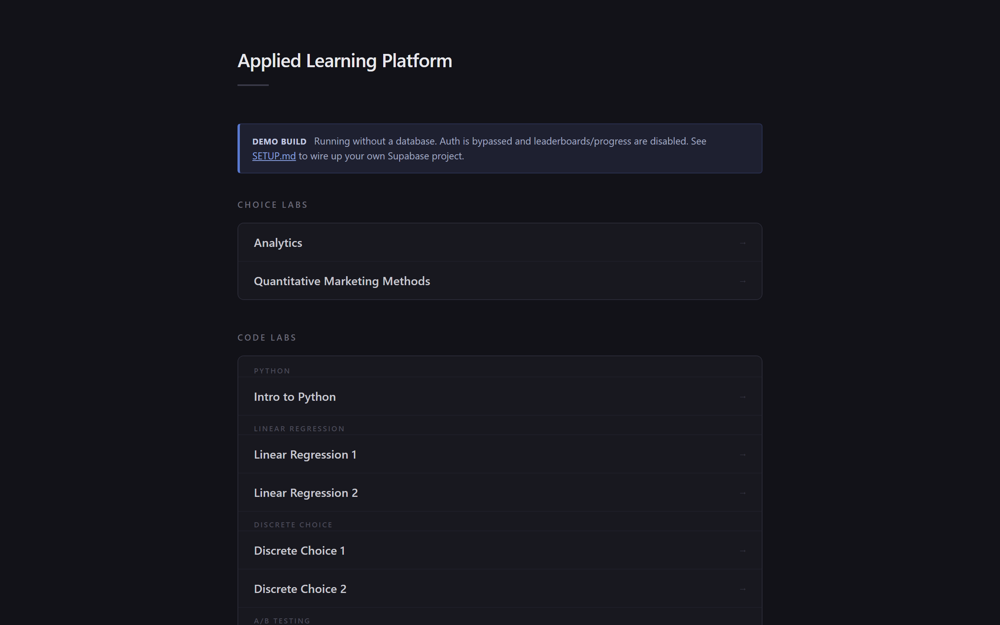
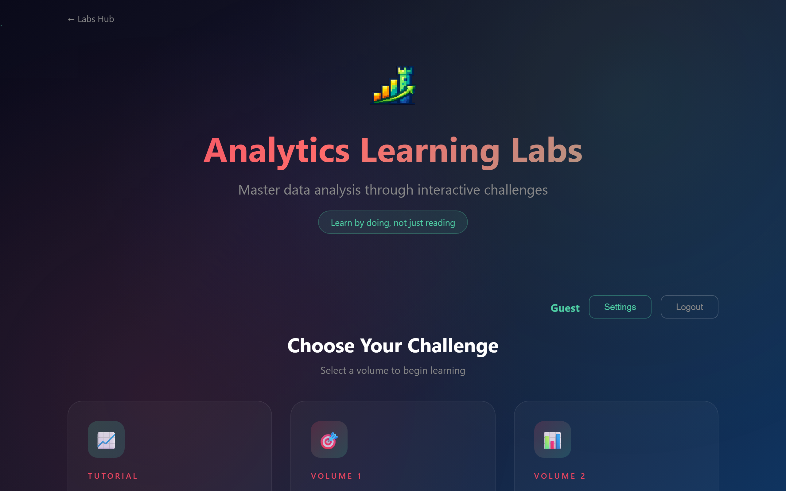
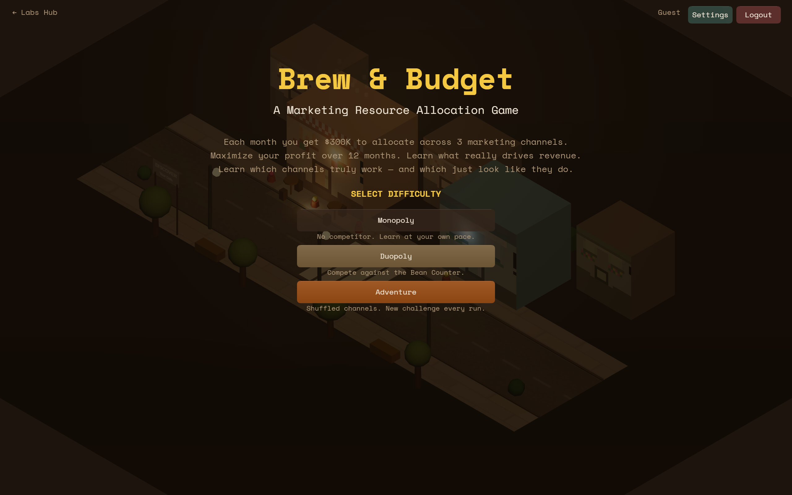
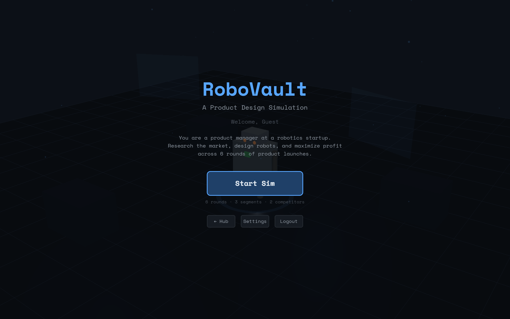
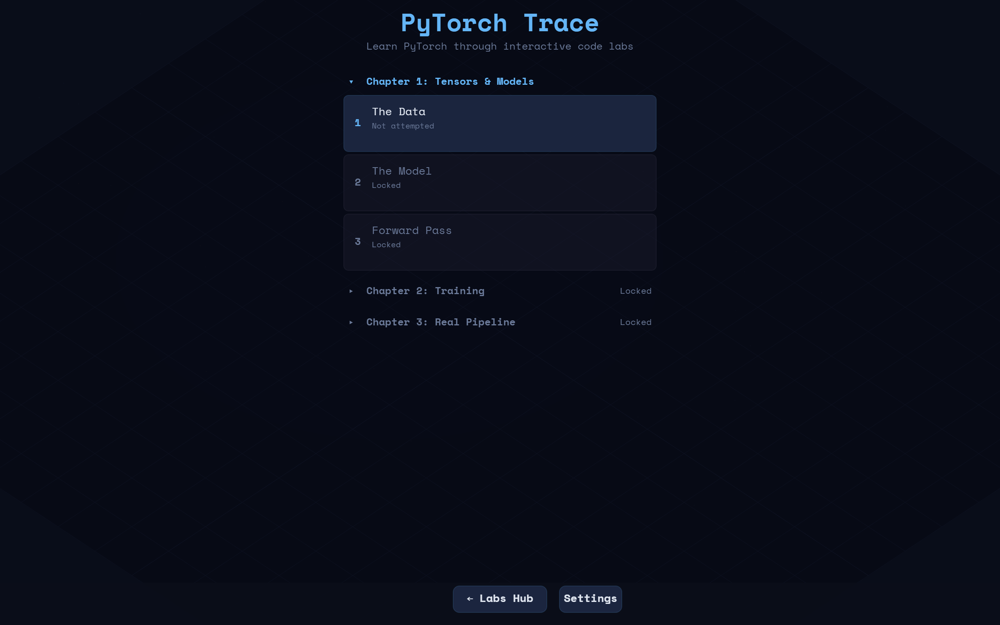
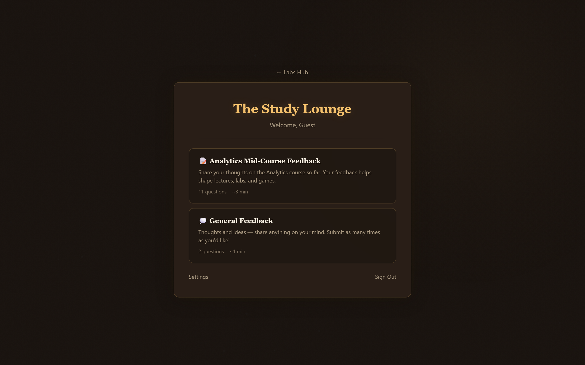

# Educational Game Platform

[](https://opensource.org/licenses/MIT) [](CONTRIBUTING.md)

Interactive browser-based games for learning data analysis, statistics, and marketing analytics. Vanilla HTML/CSS/JS with Supabase for auth and persistence. No build step.

## ▶ Try it live

The site runs in **demo mode** (no login, no setup) on GitHub Pages. Pick a game:

**Hub:** [pashasan.github.io/learning-simulation-platform](https://pashasan.github.io/learning-simulation-platform/)

**Quiz games**
- [Analytics Quiz](https://pashasan.github.io/learning-simulation-platform/choice-games/analytics/) — regression, multiple regression, discrete choice, model evaluation
- [Quantitative Marketing Methods](https://pashasan.github.io/learning-simulation-platform/choice-games/quantitative-marketing/) — PhD-level empirical methods

**Simulations**
- [Brew & Budget](https://pashasan.github.io/learning-simulation-platform/simulation-games/resource-allocation/brew-and-budget/) — marketing budget allocation
- [RoboVault](https://pashasan.github.io/learning-simulation-platform/simulation-games/product-design/robo-vault/) — product design with consumer research

**Code labs** (X-Ray / Assemble / Rewire)
- [Intro to Python](https://pashasan.github.io/learning-simulation-platform/code-labs/python-basics/) · [Linear Regression 1](https://pashasan.github.io/learning-simulation-platform/code-labs/regression-basics/) · [Linear Regression 2](https://pashasan.github.io/learning-simulation-platform/code-labs/regression-multiple/)
- [Discrete Choice 1](https://pashasan.github.io/learning-simulation-platform/code-labs/choice-binary/) · [Discrete Choice 2](https://pashasan.github.io/learning-simulation-platform/code-labs/choice-multinomial/) · [A/B Testing](https://pashasan.github.io/learning-simulation-platform/code-labs/ab-testing/)
- [PyTorch 1](https://pashasan.github.io/learning-simulation-platform/code-labs/pytorch-basics/) · [PyTorch 2](https://pashasan.github.io/learning-simulation-platform/code-labs/pytorch-nlp/) · [PyTorch 3](https://pashasan.github.io/learning-simulation-platform/code-labs/pytorch-custom/)
- [GPT 1](https://pashasan.github.io/learning-simulation-platform/code-labs/gpt-basics/) · [GPT 2](https://pashasan.github.io/learning-simulation-platform/code-labs/gpt-training/)

**Surveys**
- [Course Feedback](https://pashasan.github.io/learning-simulation-platform/survey-games/course-feedback/)

> In demo mode, auth is bypassed and you play as a guest. Leaderboards and progress aren't persisted. To run with real persistence, see **[SETUP.md](SETUP.md)**.

## Screenshots

| | |
|---|---|
|  |  |
| **[Platform hub](https://pashasan.github.io/learning-simulation-platform/)** — game selector | **[Analytics quiz](https://pashasan.github.io/learning-simulation-platform/choice-games/analytics/)** — interactive concept walkthroughs |
|  |  |
| **[Brew & Budget](https://pashasan.github.io/learning-simulation-platform/simulation-games/resource-allocation/brew-and-budget/)** — marketing budget allocation sim | **[RoboVault](https://pashasan.github.io/learning-simulation-platform/simulation-games/product-design/robo-vault/)** — product design with consumer research |
|  |  |
| **[Code labs](https://pashasan.github.io/learning-simulation-platform/code-labs/python-basics/)** — X-Ray / Assemble / Rewire exercises | **[Surveys](https://pashasan.github.io/learning-simulation-platform/survey-games/course-feedback/)** — course feedback collection |

## Run locally

```bash
git clone https://github.com/Pashasan/learning-simulation-platform.git
cd learning-simulation-platform
python -m http.server 8000
# Visit http://localhost:8000/
```

## Games

### Choice Games

Quiz-based games that test knowledge through interactive questions and scenarios.

#### Analytics Quiz Game

Quiz-based volumes covering core analytics topics. Each volume tells a story while teaching a concept through interactive questions, visualizations, and badges.

| Volume | Topic |
|--------|-------|
| Tutorial: Data Basics | Descriptive statistics, averages, spread, histograms |
| Vol 1: Regression Analysis | Linear regression, correlation, confidence intervals |
| Vol 2: Multiple Regression | Multicollinearity, VIF, adjusted R-squared, model comparison |
| Vol 3: The Choice Lab | Logistic regression, S-curve, coefficients, prediction calculator |
| Vol 4: The Choice Lab: Evaluation | Confusion matrix, precision & recall, AUC & ROC, multinomial logit |

**Open:** `choice-games/analytics/` (after running the local server — see [SETUP.md](SETUP.md))

### Simulation Games

Hands-on simulations where you make decisions and see real-time results.

#### Brew & Budget

A marketing resource allocation simulation. Players manage a coffee shop's $300K/month marketing budget across three channels over 12 months, learning which metrics actually drive revenue and which are vanity metrics.

- Three difficulty modes with AI competitors
- In-game regression analytics that unlock progressively
- Scoring against a mathematically optimal benchmark

**Open:** `simulation-games/resource-allocation/brew-and-budget/`

#### RoboVault

A product design simulation where players act as product managers at a robotics startup. Players conduct consumer research, design robots (4 attributes + pricing), and launch products into a market with hidden consumer segments.

- Mixed logit consumer choice model with hidden segments and AI competitors
- Two research methods (conjoint analysis, pricing study) with realistic estimation noise
- Post-game insight quiz testing understanding of market structure
- Scoring against a mathematically optimal benchmark (oracle)

**Open:** `simulation-games/product-design/robo-vault/`

## Tech Stack

- Vanilla HTML/CSS/JavaScript (no build step)
- Supabase (Authentication + PostgreSQL)
- Static-hostable (GitHub Pages, Netlify, Vercel, Cloudflare Pages, or any file server)
- Shared auth across all games (one account works across every game on the same origin)

## Project Structure

```
├── index.html                          # Platform hub page
├── 404.html                            # Redirect handler for old URLs
├── privacy.html                        # Privacy policy
├── terms.html                          # Terms of service
│
├── choice-games/
│   ├── analytics/                      # Analytics quiz game
│   │   ├── index.html                  #   Login & volume selector
│   │   ├── admin.html                  #   Admin dashboard
│   │   ├── settings.html               #   User settings & account deletion
│   │   ├── css/game.css                #   Shared styles
│   │   ├── js/                         #   Shared libraries
│   │   ├── volumes/                    #   One folder per volume
│   │   ├── templates/                  #   Volume templates
│   │   └── scripts/                    #   Validation tools
│   ├── pytorch/                        #   (Placeholder)
│   ├── sat-math/                       #   (Placeholder)
│   └── alignment-research/             #   (Placeholder)
│
├── simulation-games/
│   ├── resource-allocation/
│   │   └── brew-and-budget/            # Brew & Budget simulation game
│   │       ├── index.html              #   Auth/login page (cafe-themed)
│   │       ├── game.html               #   Game (Canvas 2D HUD + Three.js 3D scene)
│   │       ├── settings.html           #   User settings & account deletion
│   │       ├── admin.html              #   Admin dashboard
│   │       ├── js/                     #   All game JS (ES modules)
│   │       └── docs/                   #   Model spec, schema, variant guide
│   └── product-design/
│       └── robo-vault/                #   RoboVault product design simulation
│           ├── index.html             #     Auth/login page (tech lab theme)
│           ├── game.html              #     Game (Canvas 2D HUD + Three.js 3D scene)
│           ├── settings.html          #     User settings & account deletion
│           ├── admin.html             #     Admin dashboard
│           ├── js/                    #     All game JS (ES modules)
│           └── docs/                  #     Schema definitions
│
└── docs/                               # Platform-wide documentation
    ├── ARCHITECTURE.md                 #   Platform overview & analytics quiz architecture
    ├── SCHEMA.md                       #   Consolidated database schema reference
    ├── ADDING_VOLUMES.md               #   Guide for new quiz volumes
    ├── ADDING_GAME_TYPES.md            #   Guide for adding a new game type
    ├── GAME_DESIGN_GUIDE.md            #   Methodology for converting courses into games
    ├── SUPABASE_SETUP.md               #   Shared Supabase infrastructure reference
    ├── DEPLOYMENT.md                   #   GitHub Pages deployment and URL structure
    └── ANALYTICS_QUERIES.md            #   Example SQL queries for analytics data
```

## Documentation

| Guide | Description |
|-------|-------------|
| [SETUP.md](SETUP.md) | Step-by-step setup: Supabase project, credentials, tables, local serve |
| [docs/ARCHITECTURE.md](docs/ARCHITECTURE.md) | Platform overview, data flow, Supabase schema |
| [docs/SCHEMA.md](docs/SCHEMA.md) | Consolidated database schema reference |
| [docs/ADDING_VOLUMES.md](docs/ADDING_VOLUMES.md) | Creating new analytics quiz volumes |
| [docs/ADDING_GAME_TYPES.md](docs/ADDING_GAME_TYPES.md) | Adding a new game type to the platform |
| [docs/SUPABASE_SETUP.md](docs/SUPABASE_SETUP.md) | Shared Supabase infrastructure reference |
| [docs/DEPLOYMENT.md](docs/DEPLOYMENT.md) | GitHub Pages deployment and URL structure |
| [docs/GAME_DESIGN_GUIDE.md](docs/GAME_DESIGN_GUIDE.md) | Converting course materials into games |
| [docs/ANALYTICS_QUERIES.md](docs/ANALYTICS_QUERIES.md) | Example SQL queries for analytics data |
| [simulation-games/resource-allocation/brew-and-budget/docs/ADDING_VARIANTS.md](simulation-games/resource-allocation/brew-and-budget/docs/ADDING_VARIANTS.md) | Creating new simulation game variants |
| [simulation-games/resource-allocation/brew-and-budget/docs/SIMULATION_MODEL.md](simulation-games/resource-allocation/brew-and-budget/docs/SIMULATION_MODEL.md) | Demand model, optimal strategy derivation |
| [simulation-games/resource-allocation/brew-and-budget/docs/GAME_CREATOR_GUIDE.md](simulation-games/resource-allocation/brew-and-budget/docs/GAME_CREATOR_GUIDE.md) | Simulation game design and parameter tuning |
| [simulation-games/product-design/robo-vault/docs/SCHEMA.sql](simulation-games/product-design/robo-vault/docs/SCHEMA.sql) | RoboVault database schema |

## Running Locally

No build step required. Serve from the repo root:

```bash
python -m http.server 8000
```

Then visit:
- `http://localhost:8000/` for the platform hub
- `http://localhost:8000/choice-games/analytics/` for the analytics quiz game
- `http://localhost:8000/simulation-games/resource-allocation/brew-and-budget/` for Brew & Budget
- `http://localhost:8000/simulation-games/product-design/robo-vault/` for RoboVault

## Contributing

Contributions are welcome — new quiz volumes, code labs, simulation variants, bug fixes, docs improvements, accessibility work, and translations. See **[CONTRIBUTING.md](CONTRIBUTING.md)** for setup, PR conventions, and where to start. Beginner-friendly issues are tagged `good first issue` and `help wanted`.

## License

[MIT](LICENSE) — free to use, modify, and distribute with attribution.
